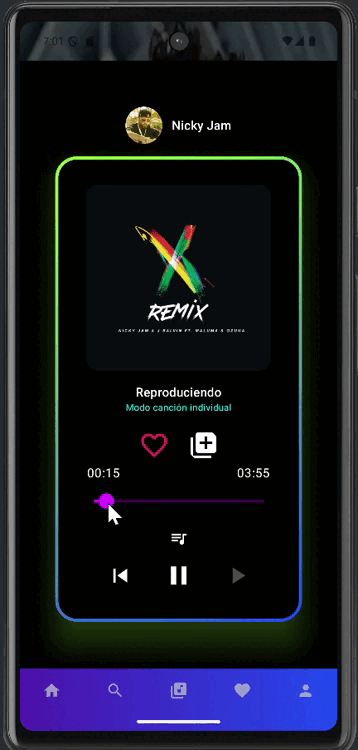
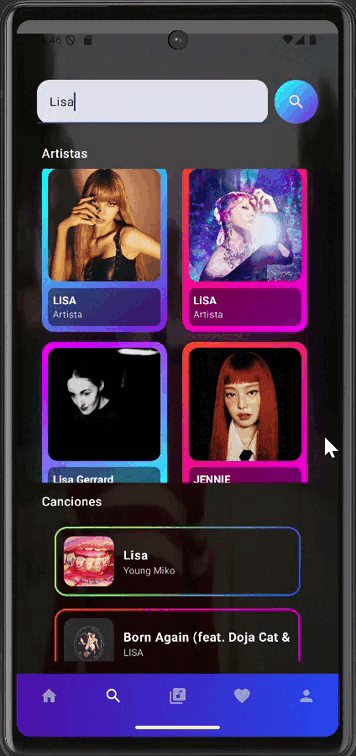
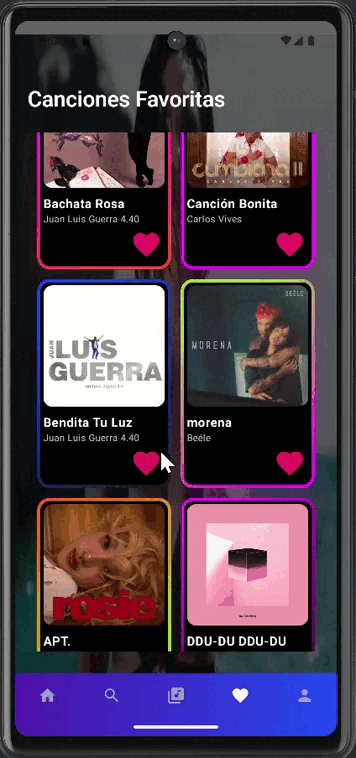

# 🎵 Melodix - Reproductor de Música Android

Melodix es una aplicación móvil nativa para Android que permite explorar, reproducir y gestionar música de forma personalizada. Combina la potencia de la API pública de Spotify para la obtención de metadatos y la API de YouTube como fuente principal de reproducción de canciones completas. Además, cuenta con un backend propio desarrollado en Spring Boot que permite gestionar canciones favoritas y listas de reproducción.

---

## 🚀 Características principales

- 🔍 **Exploración de contenido musical** mediante Spotify API.
- 🎧 **Reproducción completa de canciones** utilizando YouTube Player embebido.
- ❤️ **Gestión de favoritos** (canciones y artistas).
- 📝 **Listas de reproducción personalizadas** (crear, añadir, eliminar canciones).
- 🤖 **Sistema de recomendaciones personalizadas** basado en favoritos.
- 🔐 **Sin necesidad de autenticación de usuario**.
- 📱 **Interfaz moderna y responsiva** desarrollada con Jetpack Compose.

---

## 🧱 Tecnologías utilizadas

### 📱 Android

- **Kotlin** y **Jetpack Compose** (UI moderna y declarativa)
- **Retrofit** (consumo de APIs)
- **Room** (base de datos local con SQLite)
- **YouTube Android Player** (reproducción integrada)
- **StateFlow y ViewModel** (arquitectura MVVM)

### 🌐 Backend

- **Spring Boot (Java)** con arquitectura REST
- **MySQL** (base de datos relacional)
- **JPA (Hibernate)** para mapeo objeto-relacional

---

## 📡 APIs integradas

| API         | Uso principal                                                  |
|-------------|----------------------------------------------------------------|
| **Spotify** | Obtener metadatos de canciones, artistas, géneros y listas    |
| **YouTube** | Buscar y reproducir canciones completas                       |
| **API propia** | Gestionar favoritos y listas personalizadas vía CRUD REST  |

---

## 📷 Capturas de pantalla








---

## 🛠️ Instalación

### 🔧 Requisitos

- Android Studio Koala 2024.1.2+
- JDK 17
- Dispositivo o emulador con Android 9.0 (API 28) o superior
- API Key de YouTube (añadir manualmente en código)
- Token de Spotify vía `client_credentials` (ya integrado automáticamente)
- Backend local: Spring Boot + MySQL

### 📥 Clonar repositorio

```bash
git clone https://github.com/GelenC/Melodix.git
